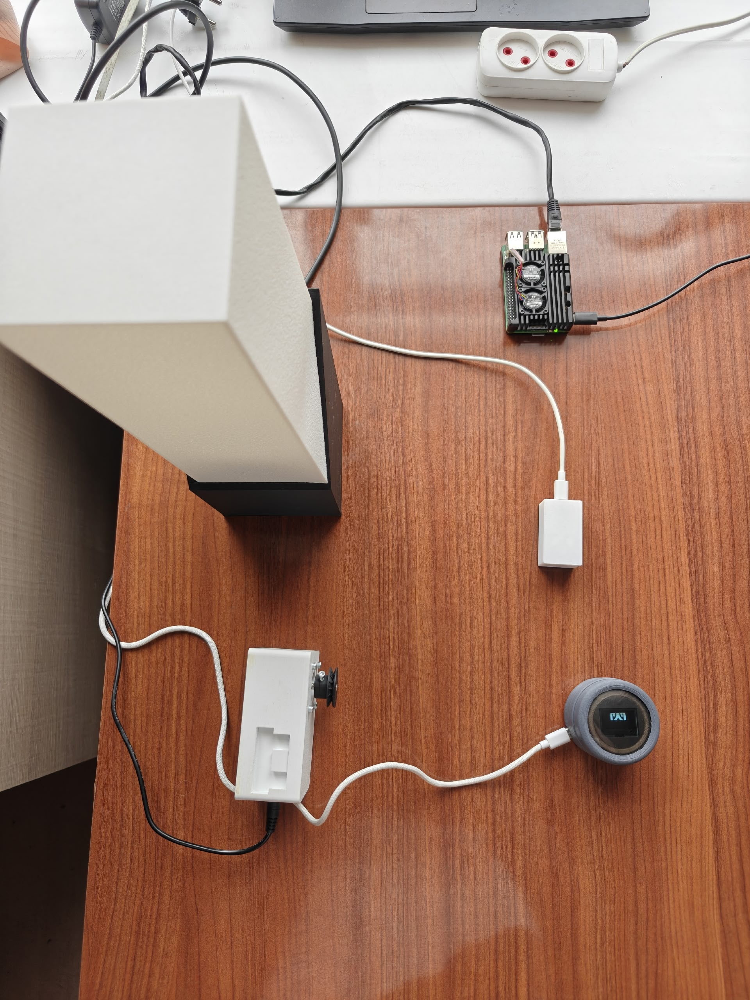

# Устройство управления конечными узлами умного дома

## Состав устройства
- Микроконтроллера ESP32 C3 SuperMini; 
− Кольцевой платы NeoPixel Ring — 16 x 5050 RGB; 
− Дисплея OLED Module 128x64 White SSD1306; 
− Тактовой кнопки; 
− Низкопрофильного инкреметального энкодера;

Результат тестирования стенда показан на гифке ниже

