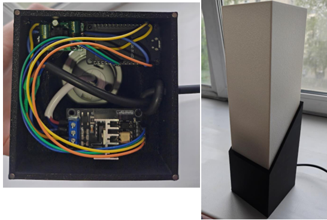
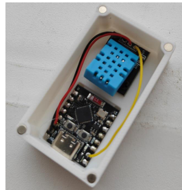
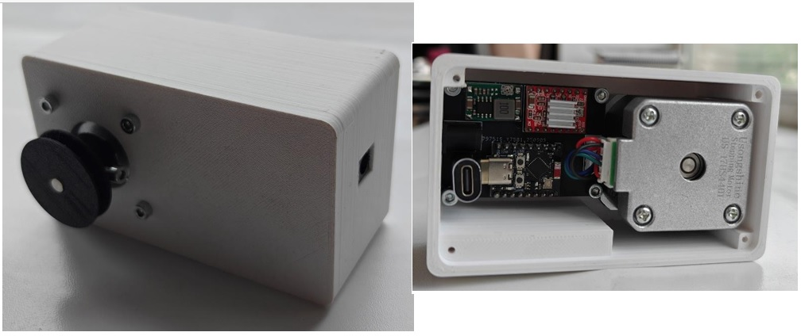

# Устройство управления конечными узлами умного дома
Проект был выполнен в рамках дипломной работы, представляет из себя устройство с помощью которого можно управлять узлами умного дома на базе открытой платформы Home Assistant. В работе продемонстрирована работа лишь с тремя устройствами, в дальнейшем можно увеличить количество поддерживаемых устройств.

## Состав устройства
- Микроконтроллера ESP32 C3 SuperMini;
- Кольцевой платы NeoPixel Ring — 16 x 5050 RGB;
- Дисплея OLED Module 128x64 White SSD1306;
- Тактовой кнопки;
- Низкопрофильного инкреметального энкодера;

Программный код разработан на языке C с использование фреймворка Arduino и платформы PlatformIo

## Тестовые стенд
Для проверки работоспособности устройства разработаны три конечных устройства:

**Диммируемая лампа ( esp32, модуль диммирования переменного тока от RobotDyn)**

**Датчик температуры и влажности (esp32 + dht11)**

**Устройство управления шторами ( esp32, двигатель nema17 и драйвер a4988)**

Для всех был написан отдельный программный код на том же стеке и выполнена привязка в Home Assistant.
Сам Home Assistant поставлен на Raspberry Pi 5.

**Стенд показан ниже.**

**Результат тестирования стенда показан на гифке ниже**

